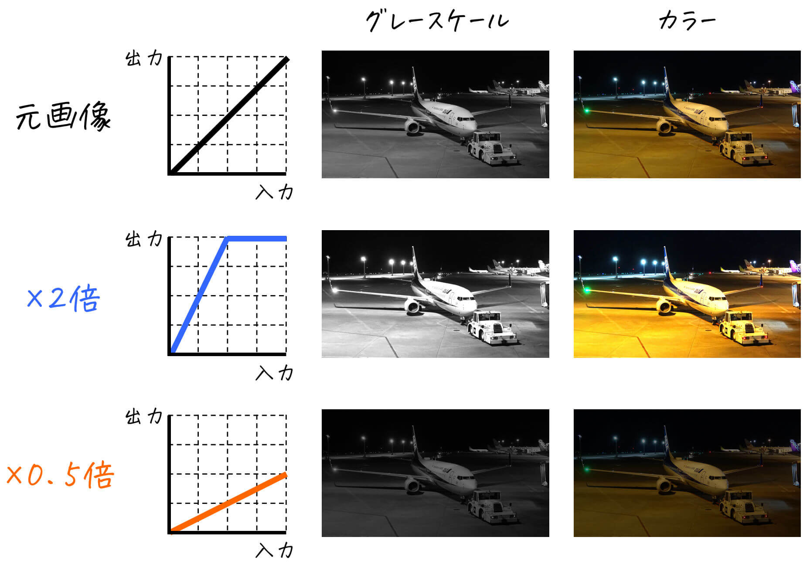
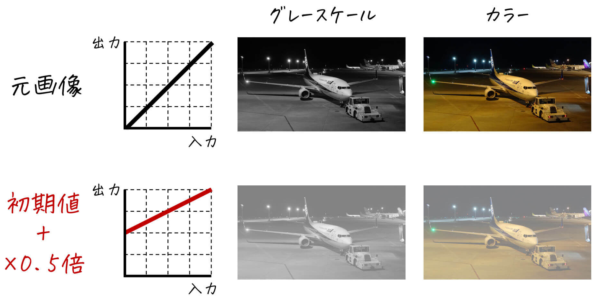
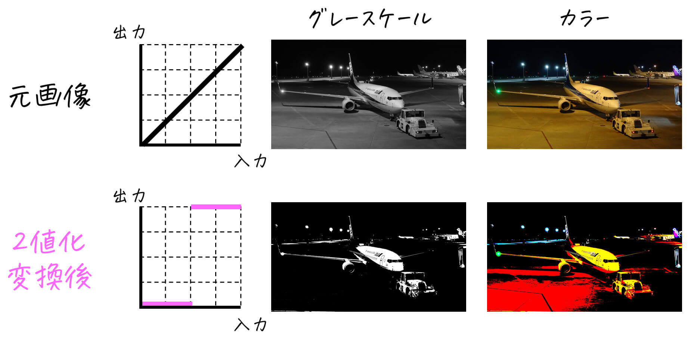
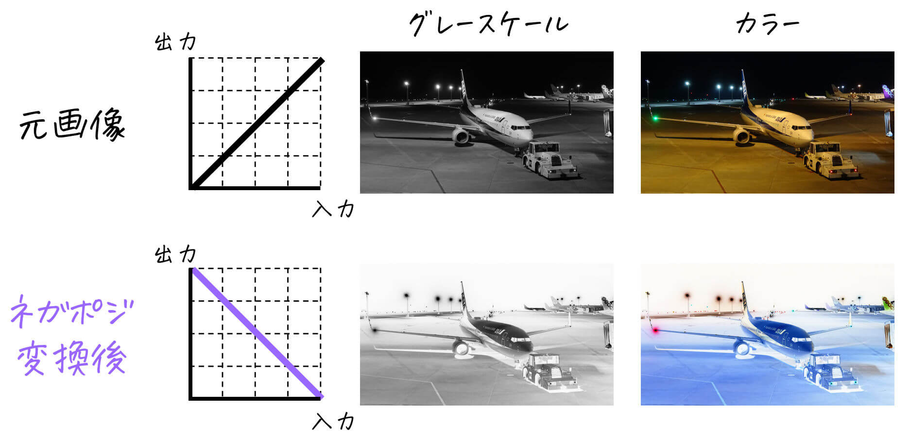
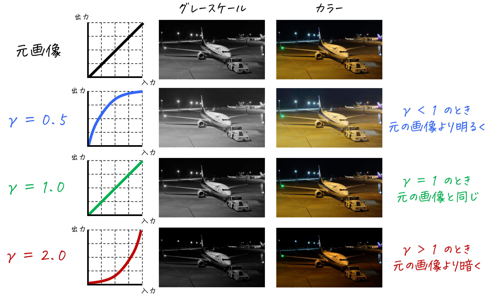
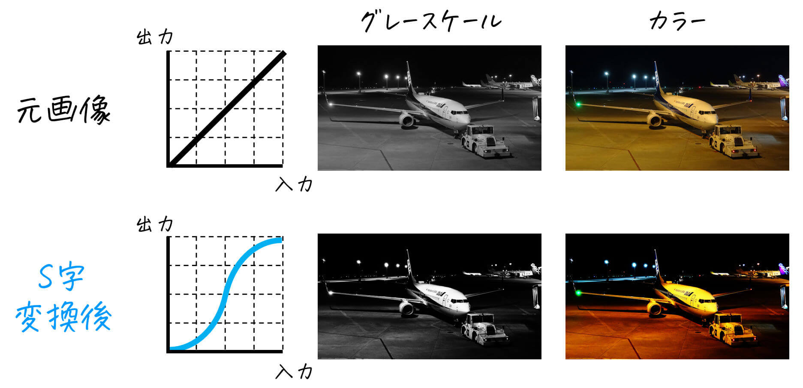
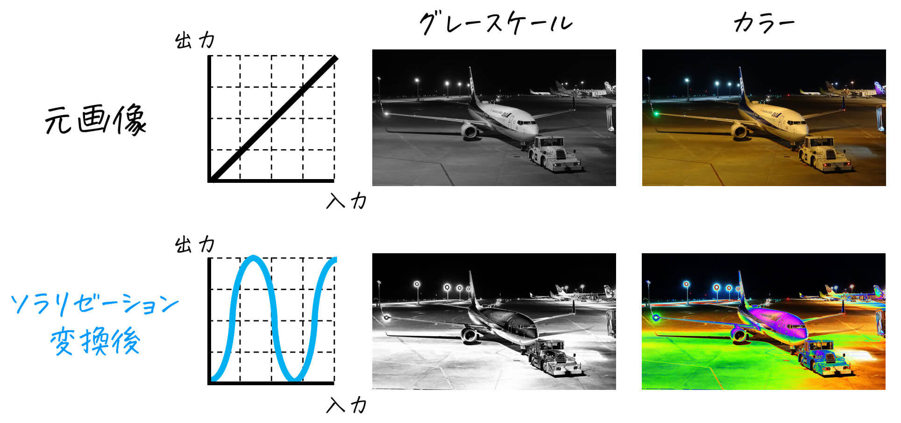
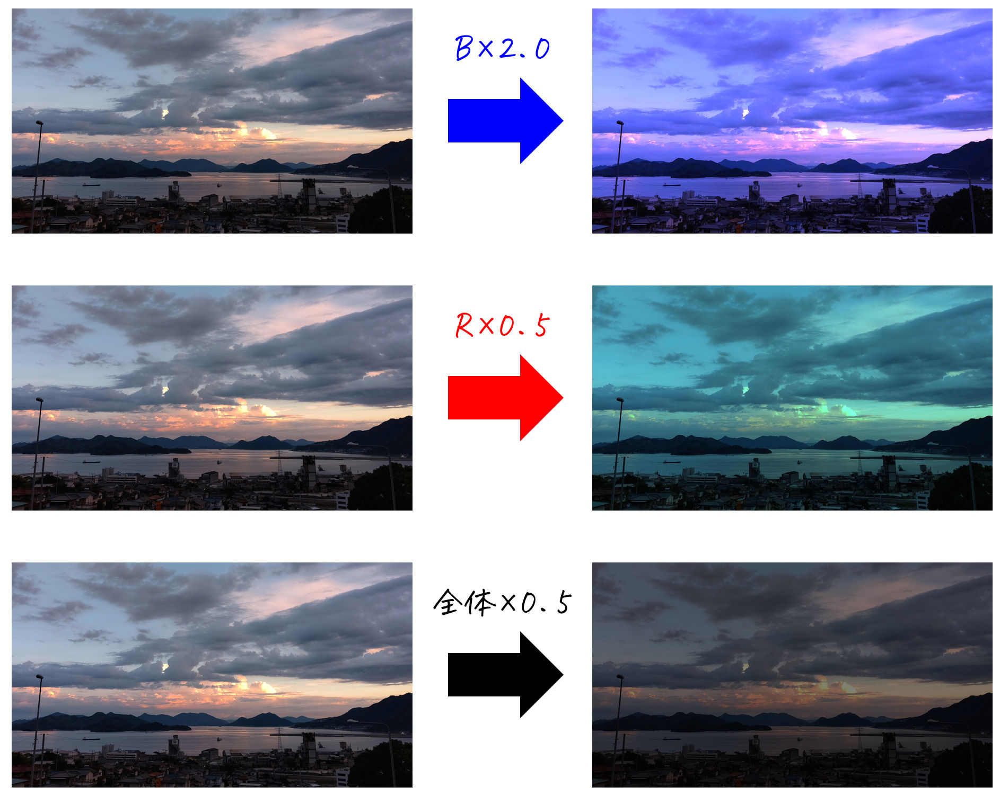

# 実際に画像処理を体験してみよう！　基礎編(トーンカーブ)

画像処理を勉強したての人が、実際にプログラムを動かすことで理解を深めるためのツール。

## 1. 概要

実際にプログラムを動かすことで、画像処理(+ コンピュータビジョン)に出てくる基本的な処理内容を実体験することができます。

* 明るさ調整 (折れ線型トーンカーブ)
* コントラストDOWN (初期値付き折れ線型トーンカーブ)
* 2変換変換
* ネガポジ変換
* ガンマ補正
* コントラストUP (S字トーンカーブ)
* ソラリゼーション
* 画像の色合い変換

## 2. 利用方法

### (1) git clone・初期設定

まず、以下のコマンドを実行することで、ローカル環境(自身のPC)にリポジトリをコピーしてください。

```
git clone https://github.com/momoyama1192/PracticeImageProcess1.git
```

言語はPython3もしくはMATLABに対応しています。ただし、Python3を使う場合は以下のコマンドを使うなどして、<b>事前に `cv2` と `numpy` のインストールが必要</b>です。

```
pip install opencv-python
pip install numpy
```

### (2) フォルダ設定

各プログラムの `設定ここから` と `設定ここまで` の間にある `INPUT_DIR`, `OUTPUT_DIR`　の設定をすることで、入力フォルダ、出力フォルダの設定ができます。また、`INPUT_FILE` を書き換えることで、画像処理を行うファイルを変更することができます。

※ リポジトリ内のフォルダ名 `input`, `output` を変更しなければ特に変更する必要はありません。

[Pythonの場合]

```Python
## 設定ここから
# 入出力フォルダ設定 
INPUT_DIR = "input/"
OUTPUT_DIR = "output/"

# ファイル設定
INPUT_FILE = "airplane1.jpg"
# 設定ここまで
```

[MATLABの場合]

```matlab
%% ファイル設定ここから
% 入力画像フォルダ設定
INPUT_DIR = "input/";
OUTPUT_DIR = "output/"; 

% 入力画像種類設定
INPUT_FILE = "airplane1.jpg";
% 設定ここまで
```

### (3) 入力画像用意

`INPUT_DIR` で指定したフォルダの中に、画像処理をしたい画像を入れてください。入れた後に、入れた画像のファイル名を `INPUT_FILE` に指定してください。

例えば、入れた画像のファイル名が `hogehoge.jpg` であれば、`INPUT_FILE` は

```python
# ファイル設定
INPUT_FILE = "hogehoge.jpg"
# 設定ここまで
```

となります。（MATLABの場合も同様です）

[補足1] グレースケール画像の画像処理を指定する場合でも「カラー画像」を入力とすることが出来ます。この場合、カラー画像をグレースケール画像に変換してから画像処理を実施します。（グレースケール画像変換後の画像は、`OUTPUT_DIR` 内のフォルダの `gray_base.jpg` として保存されます。）

[補足2] サンプル画像として以下の5つの画像を `input` 内に入れているので、是非ご利用ください。

```
airplane1.jpg
airplane2.jpg
cat.jpg
rabbit.jpg
sky.jpg
```

### (4) 実行方法

[Pythonの場合]

グレースケール画像の画像処理をしたい場合: `process_gray.py` を実行  
カラー画像の画像処理をしたい場合: `process_color.py` を実行

[MATLABの場合]

グレースケール画像の画像処理をしたい場合: `process_gray.m` を実行  
カラー画像の画像処理をしたい場合: `process_color.m` を実行


## 3. 各種画像処理手法の簡単な説明

本リポジトリで体験できる画像処理の手法を簡単に説明しています。より詳しい説明を見たい人は、下のURLに記載しているので是非ご覧ください。

https://www.momoyama-usagi.com/entry/info-img02


### (1) 明るさ調整 (折れ線型トーンカーブ)

画像の明るさを変更します。(明るさの上限[画素値255]を超えた場合は、上限値の画素値255となります。)



### (2) コントラストDOWN (初期値付き折れ線型トーンカーブ)

(1)のトーンカーブに初期値を付けた画像処理ができます。例えば、明るさ1/2倍 + 初期値127 とすることで、コントラストを下げた画像を生成できます。




### (3) 2値化変換

画像の各画素を「白」と「黒」の2つに分けます。（しきい値 `threshold` は手動で決めることが可能です）



### (4) ネガポジ変換

画像の明るい画素を暗く、暗い画素を明るくします。白猫は黒猫に、白うさぎは黒うさぎになりますね。



### (5) ガンマ補正[変換]

ガンマ値を変えた画像を生成できます。



### (6) コントラストUP (S字トーンカーブ)

コントラストが高くなった画像を生成します。



### (7) ソラリゼーション

ネガとポジが混ざり合ったような画像を生成します。



### (8) 画像の色合い変換 [カラー画像限定]

カラー画像の画像の色合いを変更することができます。

引数 `k` に1より大きい値を入れると、`color` で選択した色の色合いが強くなり、`k` に1より小さい値を入れると、`color` で選択した色の色合いが弱くなります。

